# SwapIt - Complete Application Flow Chart

> Comprehensive flowcharts and diagrams for the SwapIt skill-swapping platform

## Table of Contents
1. [System Architecture](#1-system-architecture-overview)
2. [User Authentication Flow](#2-user-authentication-flow)
3. [Profile & Post Creation](#3-profile--post-creation-flow)
4. [Matching & Discovery](#4-matching--discovery-flow)
5. [Connection Request Flow](#5-connection-request-flow)
6. [Messaging Flow](#6-messaging-flow)
7. [WebRTC Calling Flow](#7-webrtc-calling-flow)
8. [Settings Management](#8-settings--profile-management-flow)
9. [Complete User Journey](#9-complete-user-journey-flow)
10. [Database Relationships](#10-database-entity-relationship)
11. [API Request/Response](#11-api-requestresponse-flow)
12. [Technology Stack](#12-technology-stack-flow)

---

## 1. System Architecture Overview

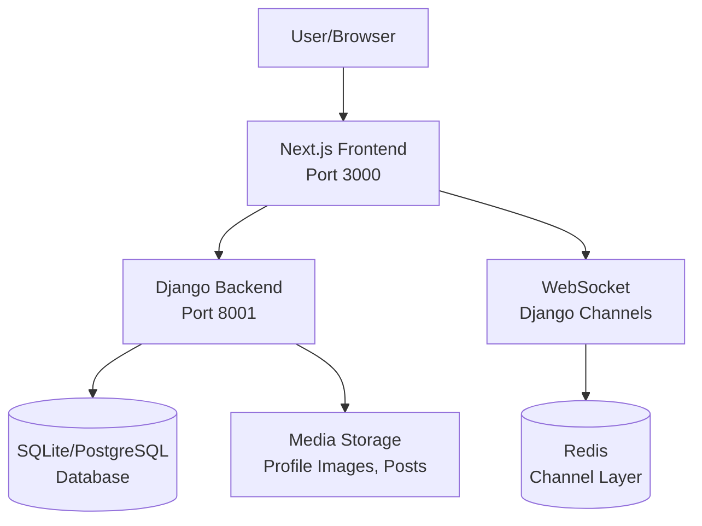

---

## 2. User Authentication Flow

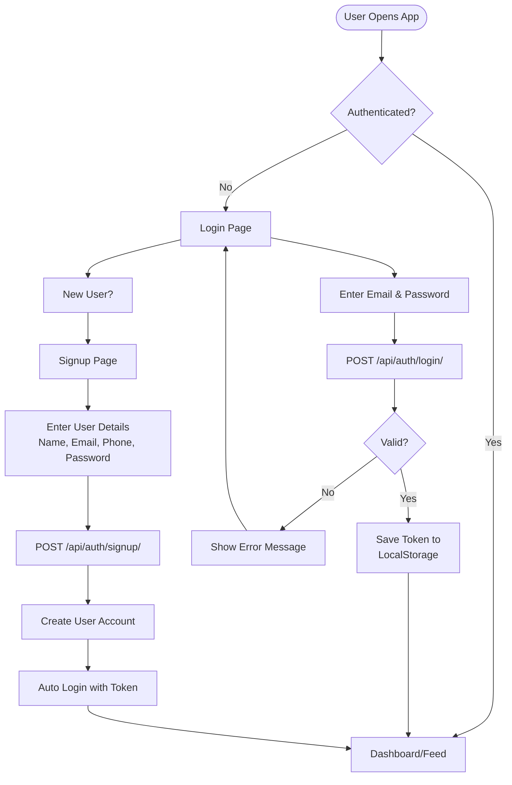

---

## 3. Profile & Post Creation Flow

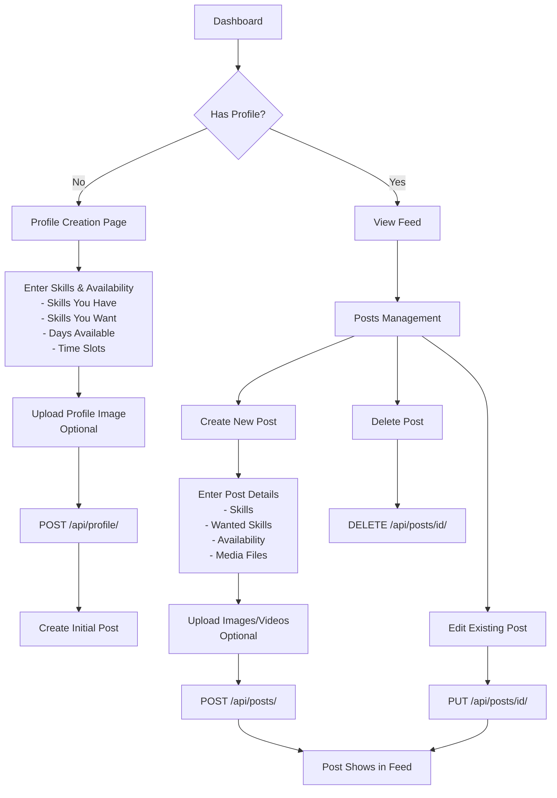

---

## 4. Matching & Discovery Flow

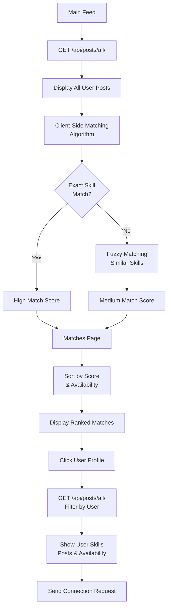

---

## 5. Connection Request Flow

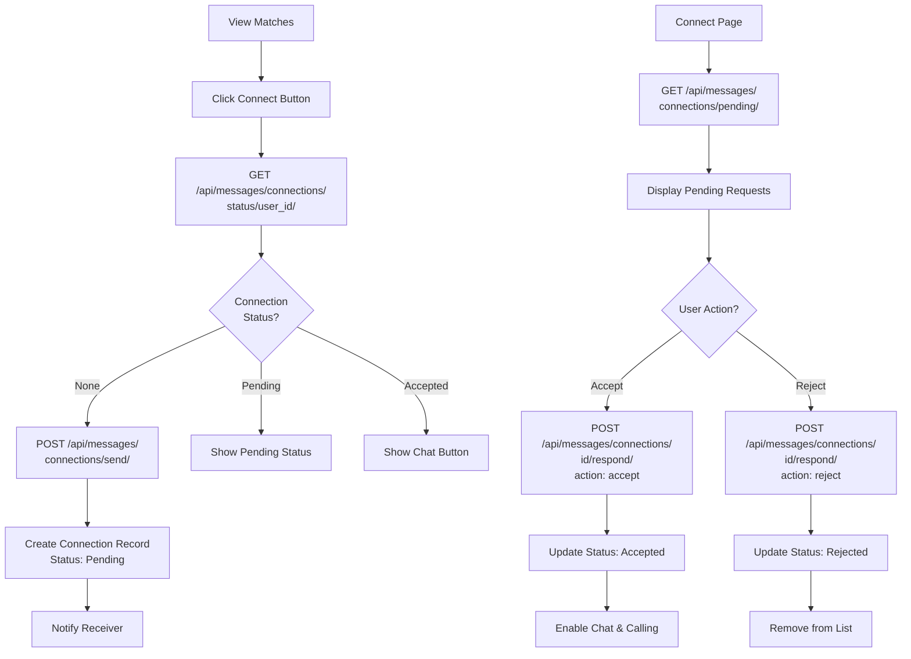

---

## 6. Messaging Flow

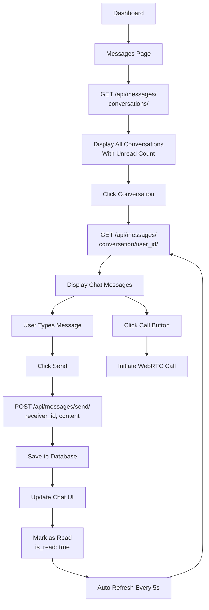

---

## 7. WebRTC Calling Flow

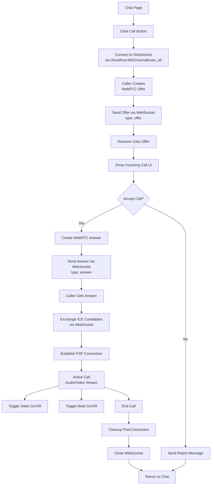

---

## 8. Settings & Profile Management Flow

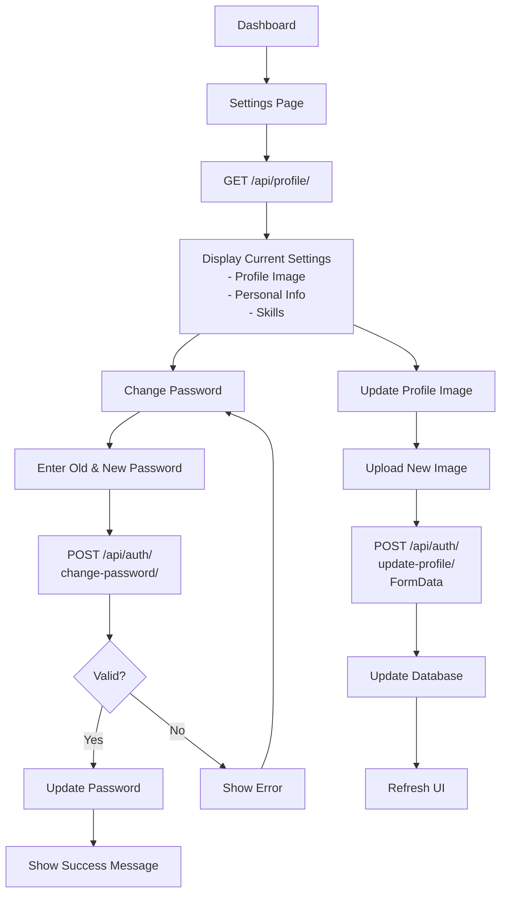

---

## 9. Complete User Journey Flow

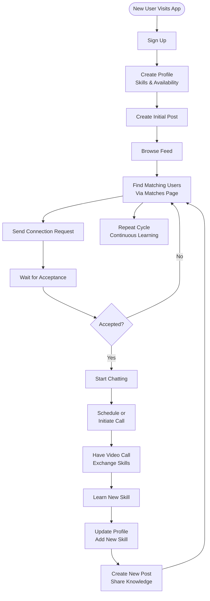

---

## 10. Database Entity Relationship

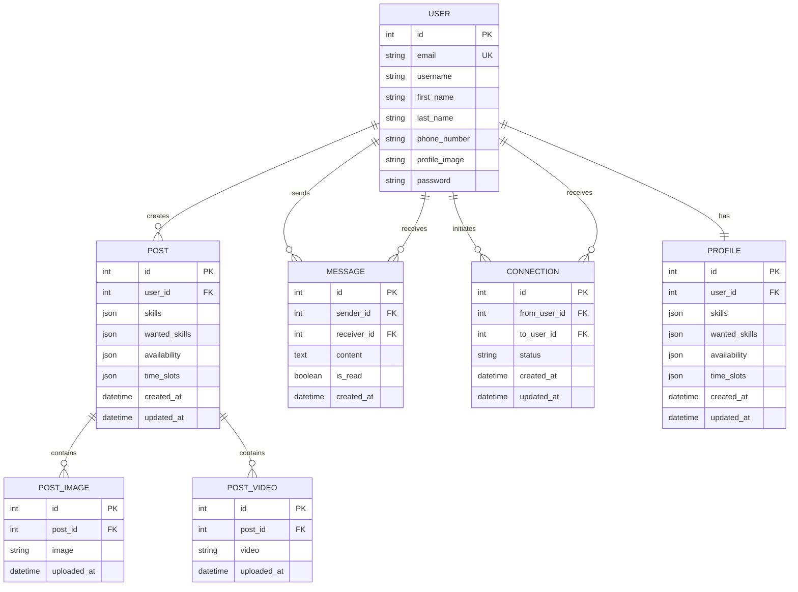

---

## 11. API Request/Response Flow

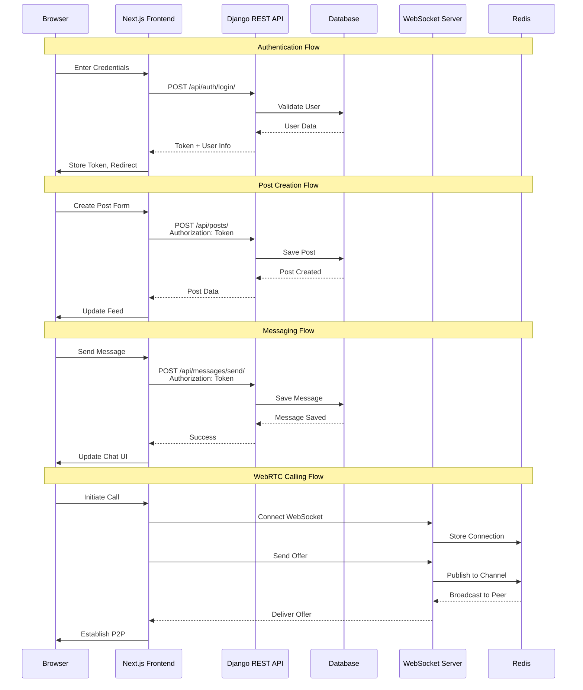

---

## 12. Technology Stack Flow

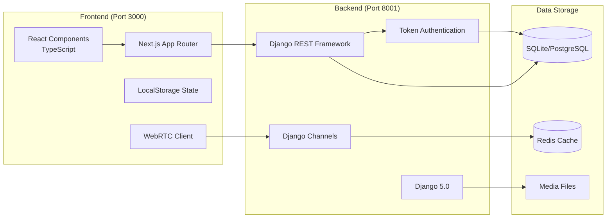

---

## Key Features Summary

### 🔐 Authentication
- Token-based authentication
- Email as username
- Secure password hashing

### 👤 Profile Management
- Skills showcase
- Availability calendar
- Profile images

### 🤝 Smart Matching
- Exact skill matching
- Fuzzy matching algorithm
- Availability alignment
- Compatibility scoring

### 💬 Real-time Messaging
- One-to-one chat
- Unread message tracking
- Auto-refresh conversations

### 📞 WebRTC Calling
- Peer-to-peer audio/video
- WebSocket signaling
- No external services

### 🔗 Connection System
- Request/Accept flow
- Status tracking (pending/accepted/rejected)
- Privacy controls

### 📱 Responsive Design
- Mobile-friendly UI
- Tailwind CSS styling
- Modern UX patterns

---

## API Endpoints Reference

### Authentication
| Method | Endpoint | Description |
|--------|----------|-------------|
| POST | `/api/auth/signup/` | Register new user |
| POST | `/api/auth/login/` | Login user |
| POST | `/api/auth/change-password/` | Change password |
| POST | `/api/auth/update-profile/` | Update profile image |

### Profile & Posts
| Method | Endpoint | Description |
|--------|----------|-------------|
| GET | `/api/profile/` | Get current user profile |
| GET | `/api/profiles/` | Get all profiles |
| GET | `/api/posts/` | Get user's posts |
| POST | `/api/posts/` | Create new post |
| GET | `/api/posts/all/` | Get all posts |
| GET | `/api/posts/:id/` | Get specific post |
| PUT | `/api/posts/:id/` | Update post |
| DELETE | `/api/posts/:id/` | Delete post |

### Messages & Connections
| Method | Endpoint | Description |
|--------|----------|-------------|
| GET | `/api/messages/conversations/` | Get all conversations |
| GET | `/api/messages/conversation/:userId/` | Get messages with user |
| POST | `/api/messages/send/` | Send message |
| POST | `/api/messages/connections/send/` | Send connection request |
| GET | `/api/messages/connections/pending/` | Get pending requests |
| POST | `/api/messages/connections/:id/respond/` | Accept/reject request |
| GET | `/api/messages/connections/status/:userId/` | Get connection status |

### WebSocket
| Endpoint | Description |
|----------|-------------|
| `ws://localhost:8001/ws/call/:userId/` | WebRTC signaling channel
